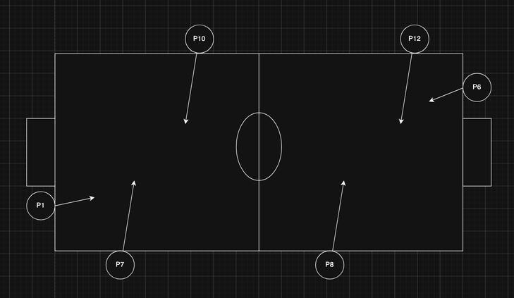

# Match 2 capture

Multi-cam capture with updated camera settings (closer zoom, high shutter) for ball detection visual checks.

## Placement



Positions on the diagram: P1, P6, P7, P8, P10, P12. Extra mounts without P-codes: Cam4plus, Cam5plus.

## File map

| Position | File | Role |
|----------|------|------|
| P1 | `data/raw/Match 2/Cam 3-P1.mp4` | Left end-line / corner |
| P6 | `data/raw/Match 2/Cam 6-P6-002.mp4` | Right end-line / corner |
| P7 | `data/raw/Match 2/Cam 11-P7-003.mp4` | Bottom touchline, left half |
| P8 | `data/raw/Match 2/Cam 14-P8-001.mp4` | Bottom touchline, right half |
| P10 | `data/raw/Match 2/Cam 8-P10-003.mp4` | Top touchline, left half |
| P12 | `data/raw/Match 2/Cam 10-P12-001.mp4` | Top touchline, right half |
| Cam4plus | `data/raw/Match 2/Cam 4+-002.mp4` | Extra mount (no P-code) |
| Cam5plus | `data/raw/Match 2/Cam 5+-004.mp4` | Extra mount (no P-code) |

Format: HEVC, 3840×2160, ~60 fps, ~22 min.

## Camera settings (Match 2)

Compared to Match 1 (old settings), Match 2 uses:

- H.265+ **off**
- I-frame interval = match fps
- Smoothing: minimum (1)
- Zoom status: NC (closer framing)
- Exposure time: **1/1000** (was 1/30)
- Sharpness: 30
- Noise reduction: off
- Day/Night switch: Day
- Scene mode: Outdoor
- Focus mode: Manual
- Time sync: NTP, interval 1

## Related test

**Match 2 gold 100 frames in a row test** — consecutive temporal strip (not stratified Match Gold100):

```bash
python3 scripts/experiments/match2_gold_100_frames_in_a_row_test.py \
  --start-sec 33 --num-frames 100 \
  --ball-checkpoint models/v8_snaps/post_train/checkpoint.pth \
  --out reports/match2_gold_100_frames_in_a_row \
  --review-dir data/processed/match2_gold_100_in_a_row
```

Report: `reports/match2_gold_100_frames_in_a_row/`.  
Dashboard: `python3 serve_viewer.py` → [http://127.0.0.1:8080/match2-100row](http://127.0.0.1:8080/match2-100row)  
Path to PoC 80%: `reports/match2_gold_100_frames_in_a_row/PATH_TO_80.md`
