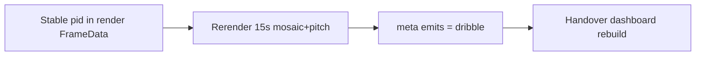

# Coach clip events sync — eng-loop prompt (#1)

**#1 priority:** `meta.json` / handover still show **movement** at ~11 s; eng-loops emit **dribble** with stable carrier pid  
**Entrypoint:** `python3 scripts/eng_loop_coach_clip_events_sync.py` → gates ≥ **9/10**

---

## Problem

Event logic PASS on fuse gold, but coach clip `check_15s_s4/coach_mosaic_pitch_min.mp4` and handover dashboard were built before dribble + stable-id fixes. Events bar shows stale **MOVEMENT** flash.

**Goal:** Rerender 15 s product clip; `meta.json` shows **dribble** @ ~11.3 s; handover dashboard synced; event eng-loops stay green.

---

## Strategy

| Step | Detail |
|------|--------|
| `render_phase1_check_mosaic` | Use fused `pid` in `_live_to_frame` |
| Rerender | start 2390 · stride 4 · 15 s · 15 fps |
| Handover | `build_phase1_handover_dashboard.py` |

---

## Gates

| Id | Pass |
|----|------|
| 01 | PROMPT + PROMPT_EVAL |
| 02 | `fuse_dribble_linked` + `heuristic_events` regression |
| 03 | `meta.json` has **dribble** emit in 10.5–11.5 s |
| 04 | No **movement** emit in 10.5–11.5 s |
| 05 | Handover `index.html` + video present |
| 06 | `n_emits` 3 (2 pass + 1 dribble) |

Report: `reports/eval_match3/improve_eng_loop/coach_clip_events_sync/scores.json`

---

## Done

Coach clip events bar flashes **DRIBBLE** on carry; handover ready for marking.
