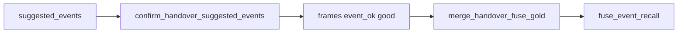

# Coach handover bulk confirm → fuse gold — eng-loop prompt (#1)

**#1 priority:** coach `frames` empty — suggested pass×2 + dribble never merge into fuse gold  
**Entrypoint:** `python3 scripts/eng_loop_coach_handover_confirm.py` → gates ≥ **9/10**

---

## Problem

Handover has **3 `suggested_events`** but **`frames: {}`**. `merge_handover_fuse_gold` only promotes coach `event_ok=good` frames — engineer gold never gets coach attribution.

**Goal:** One-click **Confirm all suggested** (UI + script); merge into fuse gold; fuse recall stays green.

---

## Strategy

| Piece | Detail |
|-------|--------|
| `confirm_handover_suggested_events.py` | Writes `fr_*` QA rows for each suggested emit |
| Handover UI | **Confirm all suggested** button → save labels |
| Eng-loop | Fixture apply + merge + restore empty frames after gate |

---

## Gates

| Id | Pass |
|----|------|
| 01 | PROMPT + PROMPT_EVAL |
| 02 | Handover `suggested_events` ≥ 3 |
| 03 | Confirm script marks ≥ 3 `event_ok=good` frames |
| 04 | Merged gold has ≥ 3 `source=handover` events |
| 05 | `fuse_event_recall` PASS |
| 06 | `fuse_linked_gold_primary` regression |

Report: `reports/eval_match3/improve_eng_loop/coach_handover_confirm/scores.json`

---

## Done

Coach can confirm suggested events in one click; merge path verified; eng-loop restores empty `frames` after CI run.
