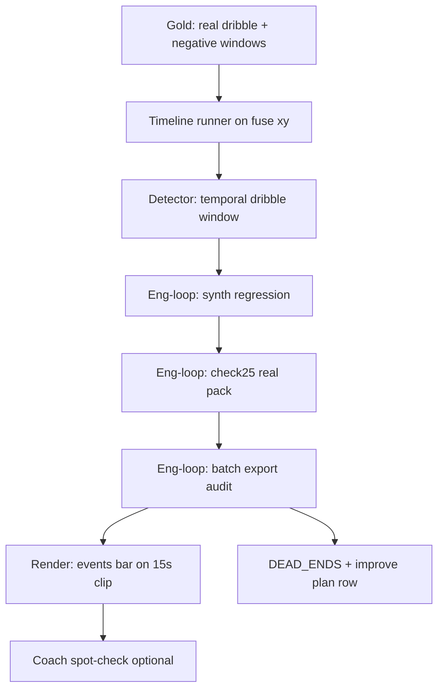

# Dribble precision + real-batch anti-spam — eng-loop prompt

**Mode:** Loop engineering (agent + scripts). Coach labels only where noted.  
**Entrypoint score:** `python3 scripts/eng_loop_dribble_precision.py` → all gates ≥ **9/10**  
**Runner:** `python3 scripts/eng_loop_run_dribble_precision_prompt.py` (mirror + all gates)

---

## Problem (honest snapshot)

| Surface | Dribble behaviour | Score hint |
|---------|-------------------|------------|
| Synth gold (`synth_dribble_midfield`) | TP, **P_emit 1.0** | Toy clip OK |
| Real check25 fuse (25 s, 3 labels) | No dribble spam; **P_emit_real 1.0** | Tiny sample |
| **Batch export** (`full_match_2min/P10-002`) | **283 dribble** vs 47 pass, 0 shot/recovery/movement | **Spam** (~2+/s) |
| 15 s oriented demo | 0 dribble emits (pass + movement only) | Inconsistent |

Eng-loop **passes** on micro gold but **fails coach trust** on real batch timelines: dribble fires on map jitter + cling, not sustained carries.

**Goal:** Keep **P_emit ≥ 0.80** on all event types; cut real-batch dribble spam to a **coach-plausible rate** without breaking pass/shot/recovery/movement gates.

---

## Strategy (locked for this loop)

Do **not** lower `EMIT_CONF`. Do **not** retune ball map/hull for event recall.

### Dependency graph



### 1. Real gold — dribble + negatives (human growth)

Build **`match3_events_v2_dribble`** (or extend `match3_events_v1`):

| Clip id | Source | Labels |
|---------|--------|--------|
| `real_dribble_carry_15s` | Product fuse timeline from `check_15s_s4` frames_src | ≥2 **true dribble** windows (coach or engineer); ≥3 **negative** windows (static ball, pass, map jitter) |
| `real_batch_p10_2min_audit` | Replay `data/output/full_match_2min/P10-002/frame_data.csv` → fuse xy timeline | Negatives only: sample 10 windows where batch emitted dribble but ball/player static on video |
| `synth_*` | Existing manifest | **Regression** — must still pass |

Label format (same as v1): `labels.json` → `events[]` with `type`, `t_start`, `t_end`.

Optional growth path: import coach flags from `phase1_handover/labels.json` (`event_ok=bad` + note).

Script target: `scripts/gold_set/build_match3_dribble_gold.py`

### 2. Temporal dribble (detector change — primary fix)

Replace **single-frame-pair** dribble emit with a **short window** (precision-first):

| Parameter | Start value | Role |
|-----------|-------------|------|
| `dribble_window_frames` | 3 | Need N consecutive fuse steps with ball–player cling |
| `dribble_min_carry_m` | 0.6 | Total ball displacement over window |
| `dribble_max_speed_m_s` | `pass_velocity_threshold * 0.85` | Below pass band |
| `dribble_co_move_streak` | 2 | Co-movement cos gate on ≥2 steps in window |
| Per-player cooldown | reuse `min_emit_gap_s` | Same 1.0 s global cooldown |

Emit **once** at window end; conf = `min(1.0, 0.82 + carry_m / 4.0)` — must stay ≥ **0.80**.

Keep priority: `shot > pass > recovery > dribble > movement`.

Unit tests: extend `scripts/test_heuristic_events_e0.py` — window TP, jitter FP=0, pass-band exclusion.

### 3. Batch export audit gate (new — kills 283-problem)

Scorer: `scripts/eng_loop_dribble_precision.py`

| Gate id | Metric | Pass (≥9/10) |
|---------|--------|--------------|
| `01_prompt` | This PROMPT exists | 10 |
| `02_synth_regression` | `eng_loop_heuristic_events.py` still exit 0 | 10 |
| `03_real_check25_p_emit` | `p_emit_real ≥ 0.80`, FP=0 on check25 | 10 |
| `04_real_dribble_recall` | ≥1 TP on `real_dribble_carry_15s` labeled dribbles | 9 |
| `05_negative_windows` | FP=0 on labeled negatives + `synth_goal_jitter_none` | 10 |
| `06_batch_dribble_rate` | Re-run events on P10 2min fuse timeline: **≤ 0.5 dribble emits / min** (≤30 in 120 s) | 9 |
| `07_batch_p_emit` | P_emit on batch dribble emits vs audit negatives ≥ 0.80 | 9 |
| `08_pass_shot_recovery` | No regression: check25 pass TP unchanged; synth shot/recovery pass | 10 |
| `09_movement_regression` | `synth_movement_midfield` still TP | 9 |
| `10_config_yaml` | New knobs in `configs/default.yaml` under `events.dribble_*` | 9 |
| `11_dead_ends` | Log failed A/B in `reports/events_testing/DEAD_ENDS.md` | 9 |
| `12_render_proof` | Rerender `check_15s_s4/coach_mosaic_pitch_min.mp4`; `n_dribble` in meta ≤ 2 for 15 s | 9 |

Report: `reports/eval_match3/improve_eng_loop/dribble_precision/scores.json`

### 4. Render proof

```bash
python3 scripts/gold_set/render_phase1_check_mosaic.py \
  --start 2390 --match-sec 15 --stride 4 --out-fps 15 \
  --out-dir reports/eval_match3/improve_eng_loop/player_map/check_15s_s4 \
  --out-file coach_mosaic_pitch_min.mp4

python3 scripts/gold_set/build_phase1_handover_dashboard.py
```

Coach watches events bar: dribble flashes only on visible carries (not every cling frame).

---

## Verification checklist (must pass before merge)

### A. Scores

```bash
python3 scripts/eng_loop_heuristic_events.py      # regression
python3 scripts/eng_loop_dribble_precision.py   # this loop
python3 scripts/eng_loop_run_dribble_precision_prompt.py
```

### B. Batch replay (not stale `events.json`)

Rebuild timeline from `frame_data.csv` + fuse, count emits by type. Do **not** trust old `events.json` without re-run.

### C. Regression hard no

- `EMIT_CONF` ≥ 0.80
- Pitch 1 half-length 26.95 m (not FIFA)
- No ball map / hull / MIN_SUPPORT changes
- No learned event models
- No goal-band hard exclusion for dribble (use co-move + window)

---

## Loop workflow (agent)

1. **Branch** e.g. `fix/dribble-precision-batch-gate`.
2. **Gold** — build `real_dribble_carry_15s` + audit negatives; commit manifest under `data/processed/gold_sets/`.
3. **Detector** — implement temporal window in `src/events/events.py`; wire `configs/default.yaml`.
4. **Tests** — extend `test_heuristic_events_e0.py`.
5. **Scorer** — `eng_loop_dribble_precision.py` + runner script.
6. **Tune** — threshold A/B; log dead ends; **do not** lower emit conf.
7. **Regression** — full `eng_loop_heuristic_events.py` + batch rate gate.
8. **Render** — 15 s clip + sync handover dashboard.
9. **Docs** — `HEURISTIC_EVENTS_IMPROVE_PLAN.md` row; `PHASE1_STATUS` events score.
10. **Commit** when all gates ≥9/10 — message e.g. `Dribble: temporal window + batch anti-spam gate`.

---

## Wire map

| Piece | Path |
|-------|------|
| Detector | `src/events/events.py` |
| Config | `configs/default.yaml` → `events.*` |
| Synth gold | `data/processed/gold_sets/match3_events_v1/` |
| Dribble gold | `data/processed/gold_sets/match3_events_v2_dribble/` |
| Offline runner | `scripts/gold_set/run_match3_events_offline.py` |
| Parent eng-loop | `scripts/eng_loop_heuristic_events.py` |
| **This loop** | `scripts/eng_loop_dribble_precision.py` |
| Batch sample | `data/output/full_match_2min/P10-002/` |
| Coach labels | `reports/eval_match3/improve_eng_loop/phase1_handover/labels.json` |
| Render | `scripts/gold_set/render_phase1_check_mosaic.py` |
| Dead ends | `reports/events_testing/DEAD_ENDS.md` |

---

## Done definition

- Synth + check25 **P_emit** hold at ≥ 0.80 with **FP=0** on negatives.
- P10 2min replay: **≤30 dribble emits** and coach-plausible events bar on 15 s clip.
- `eng_loop_dribble_precision.py` exit 0; `scores.json` all components ≥ 9.
