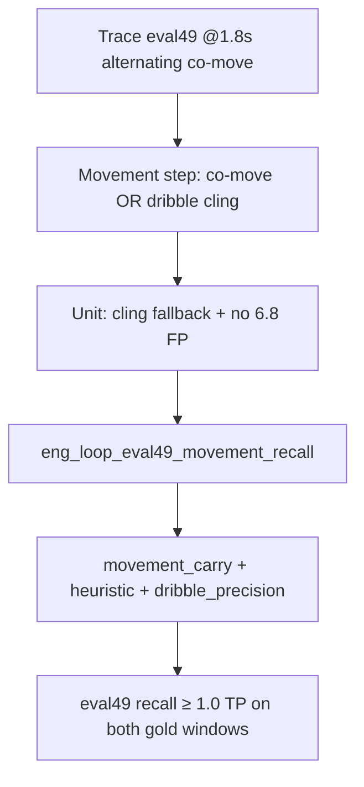

# Eval49 movement recall — eng-loop prompt

**Mode:** Loop engineering · **Fuse cling fallback (not threshold chase)**  
**Entrypoint:** `python3 scripts/eng_loop_eval49_movement_recall.py`  
**Runner:** `python3 scripts/eng_loop_run_eval49_movement_recall_prompt.py`

---

## Problem

`movement_carry` fixed eval49 **P_emit** (0.50 → **1.0**) by killing late jitter FP, but **recall** on eval49 is still **0.5**:

| Gold | Emitted? |
|------|----------|
| movement @1.5–2.0 s | **FN** — co-move alternates frame-to-frame on fuse xy |
| dribble @3.0–3.5 s | TP |

Root cause: strict `_co_movement_ok` passes on ~every other stride-4 step; movement buffer resets. Dribble already has **cling fallback** for fuse player lag — movement does not.

---

## Dependency graph

---

## Strategy (locked)

| Do | Don't |
|----|-------|
| Reuse `_dribble_cling_step` as movement step fallback | Tune thresholds to one clip |
| Keep movement 2-step window + min carry 0.35 m | Lower emit conf |
| Keep shot-only kickoff | ML classifier |

---

## Gates

| Id | Pass (≥9/10) |
|----|----------------|
| 01 | PROMPT exists |
| 02 | Unit E0 exit 0 |
| 03 | `movement_carry` exit 0 |
| 04 | **eval49 recall ≥ 0.5** with **2/2 TP** |
| 05 | eval49 P_emit ≥ 0.80 |
| 06 | eval49 FP outside gold = 0 |
| 07 | fuse15 + holdout P_emit ≥ 0.80 |

Report: `reports/eval_match3/improve_eng_loop/eval49_movement_recall/scores.json`
