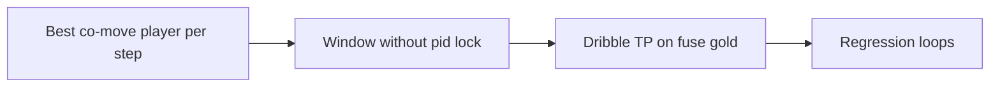

# Fuse carry dribble (no track-ID lock) — eng-loop prompt

**#1 priority:** fuse xy + unstable player IDs block dribble window  
**Entrypoint:** `python3 scripts/eng_loop_fuse_carry_dribble.py` → gates ≥ **9/10**

---

## Problem

Fuse stride-4 timeline: **player 6 jumps 15 m** between samples while ball carries smoothly → same-pid dribble window never completes. **Movement** fires; **dribble** stays 0.

**Goal:** Emit **dribble** on visible carry (10.5–11.5 s) via **ball carry window** without requiring one track id across steps. Keep P_emit ≥ 0.80, batch dribble ≤ 30, parent loops green.

---

## Strategy

| Change | Detail |
|--------|--------|
| `_dribble_cling_step` | Pick **best** co-moving player near prev ball (not first match) |
| `_detect_dribble_window` | Drop **same-pid** requirement; `involved_players=[last_pid]` |
| Bounds | No emit conf drop · no map retune |

---

## Gates

| Id | Pass |
|----|------|
| 01 | PROMPT + PROMPT_EVAL |
| 02–04 | heuristic + dribble_precision + fuse_event_recall |
| 05 | Dribble **TP ≥1** on 10.5–11.5 s fuse gold |
| 06 | Fuse dribble count **1–3** |
| 07 | Fuse P_emit ≥ 0.80 |
| 08 | Batch dribble ≤ 30 |

Report: `reports/eval_match3/improve_eng_loop/fuse_carry_dribble/scores.json`

---

## Done (2026-08-23)

- Fuse 15 s gold: **dribble** @ 11.2–11.33 s (not movement-only).
- `eng_loop_fuse_carry_dribble.py` + parent loops **PASS**.
- Code: `src/events/events.py` window=2, no pid lock, movement/cooldown carry completion.
