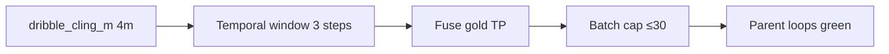

# Fuse dribble cling — eng-loop prompt (#1)

**Mode:** Loop engineering · after D3 anti-spam + fuse carry recall  
**Entrypoint:** `python3 scripts/eng_loop_fuse_dribble_cling.py` → gates ≥ **9/10**

---

## Problem

Fuse 15 s has **carry recall** via **movement** (P_emit 1.0) but **0 dribble** emits. Root cause: `dribble_distance_threshold` **2.0 m** — nearest mapped player at carry is **~2.7 m** (fuse xy). Movement uses **4.0 m** proximity and fires.

Coaches still want **dribble** when the ball is carried with a player, not only generic movement.

**Goal:** Emit **≥1 dribble TP** on fuse gold carry window **without** reopening batch spam (≤30) or breaking fuse carry / pass gates.

---

## Strategy

| Change | Detail |
|--------|--------|
| **Shared cling radius** | `dribble_cling_m` = `movement_proximity` (4.0 m) for ball–player distance; keep co-move + temporal window |
| **No emit conf drop** | ≥ 0.80 |
| **No map retune** | — |

---

## Gates

| Id | Pass |
|----|------|
| 01 | PROMPT + PROMPT_EVAL |
| 02–03 | heuristic + dribble_precision + fuse_event_recall regression |
| 04 | Fuse **dribble TP ≥1** on labeled carry (10.5–11.5 s) |
| 05 | Fuse dribble count **1–2** (not 0, not spam >4) |
| 06 | Fuse P_emit ≥ 0.80 |
| 07 | Batch dribble ≤ 30 |
| 08 | Pass windows still 2 TP |

Report: `reports/eval_match3/improve_eng_loop/fuse_dribble_cling/scores.json`

---

## Hard no

Lower emit conf · FIFA meters · map/hull retune · single-frame dribble revert

---

## Done

Visible carry can show **DRIBBLE** flash on fuse 15 s; eng-loop exit 0.
