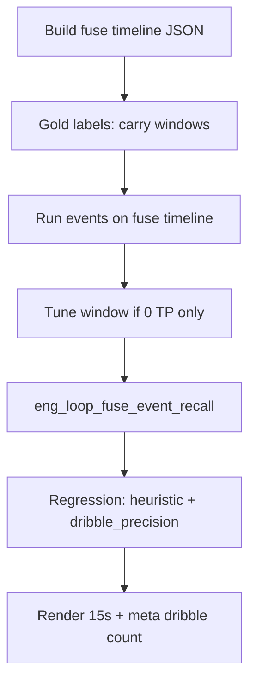

# Fuse event recall (product 15s) — eng-loop prompt

**Mode:** Loop engineering · **#1 priority after D3 anti-spam**  
**Entrypoint:** `python3 scripts/eng_loop_fuse_event_recall.py` → all gates ≥ **9/10**  
**Runner:** `python3 scripts/eng_loop_run_fuse_event_recall_prompt.py`

---

## Problem

D3 temporal dribble fixed **batch spam** (283 → 0) but **product fuse** still shows **0 dribbles** on the 15 s check clip (2 pass + 1 movement). Coaches need **visible carries** labeled as dribble on **fuse xy**, without reopening batch spam.

| Surface | Emits (15 s stride 4) | Issue |
|---------|----------------------|--------|
| Pre-D3 batch P10 | 283 dribble | Spam |
| Post-D3 batch replay | 0 dribble | Gappy single-cam csv — OK for anti-spam |
| Post-D3 fuse 15 s | 0 dribble, 2 pass, 1 movement | **No dribble recall on product path** |

**Goal:** On **product fuse timeline** (`check_15s_s4` params): **P_emit ≥ 0.80**, **≥1 carry TP** (movement or dribble) on labeled window, **1–4 carry emits** total (movement + dribble). Parent eng-loops stay green.

---

## Dependency graph



---

## Strategy (locked)

- **Do not** lower `EMIT_CONF` below 0.80.
- **Do not** retune ball map / hull / MIN_SUPPORT.
- **Do not** revert to single-frame dribble.
- Tune only `dribble_min_carry_m`, `dribble_window_frames`, `dribble_co_move_streak` within bounds in PROMPT_EVAL.
- Batch anti-spam gate stays: **≤30 dribbles** on P10 csv replay.

### 1. Fuse timeline gold

Path: `data/processed/gold_sets/match3_events_v2_dribble/clips/real_fuse_15s/`

```bash
python3 scripts/gold_set/build_fuse_15s_timeline.py
```

Writes `timeline.json` (product fuse xy, defish tiles, `apply_undistort=False`).

### 2. Human/engineer labels (`labels.json`)

| Window | Type | Note |
|--------|------|------|
| t 10.5–11.5 s | **movement** | Visible co-move carry on fuse xy (cling too loose for dribble) |
| t 1.5–2.0 s | **pass** | High-speed leave — not dribble |
| t 4.8–5.5 s | **pass** | Second pass window |
| t 0–1.0 s | **negative** | No emit required |

Builder: `scripts/gold_set/build_fuse_event_gold.py`

### 3. Tune bounds (if fuse TP = 0)

| Knob | Min | Max |
|------|-----|-----|
| `dribble_min_carry_m` | 0.45 | 0.60 |
| `dribble_window_frames` | 2 | 3 |
| `dribble_co_move_streak` | 2 | 2 |

Log A/B in `reports/events_testing/DEAD_ENDS.md`.

### 4. Gates (`eng_loop_fuse_event_recall.py`)

| Id | Pass (≥9/10) |
|----|----------------|
| 01 | PROMPT + PROMPT_EVAL exist |
| 02 | `eng_loop_heuristic_events.py` exit 0 |
| 03 | `eng_loop_dribble_precision.py` exit 0 |
| 04 | Fuse timeline + labels exist |
| 05 | **Carry recall ≥1 TP** (movement or dribble on labeled window) |
| 06 | Carry count **1–4** (movement + dribble) on 15 s |
| 07 | Fuse **P_emit ≥ 0.80** (all types) |
| 08 | Pass windows still TP (no regression) |
| 09 | Batch dribble **≤30** |
| 10 | `meta.json` carry count **1–4** after render |

Report: `reports/eval_match3/improve_eng_loop/fuse_event_recall/scores.json`

---

## Done definition

Coach sees **1–3 carry flashes** (movement or dribble) on visible carries in `coach_mosaic_pitch_min.mp4`; eng-loop fuse recall passes; batch spam gate still passes.
