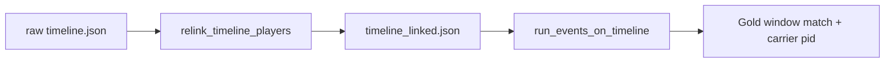

# Fuse linked timeline as primary gold scorer — eng-loop prompt (#1)

**#1 priority:** score fuse event gold on **stable-id** `timeline_linked.json` (not raw slot-order timeline)  
**Entrypoint:** `python3 scripts/eng_loop_fuse_linked_gold_primary.py` → gates ≥ **9/10**

---

## Problem

Raw fuse timeline uses per-frame slot ids (`j+1`) — dribble emits **player 5** while linked sticky fuse id is **34**. Gold labels and coach handover need **one canonical carrier pid** for carry windows.

**Goal:** Build + persist linked timeline; gold labels declare `timeline_primary` + `expected_carrier_pid`; eng-loop scores emits from linked xy.

---

## Strategy

| Piece | Detail |
|-------|--------|
| `build_fuse_linked_timeline.py` | Writes `timeline_linked.json` |
| `build_fuse_event_gold.py` | `timeline_primary`, dribble `expected_carrier_pid: 34` |
| Gates | Linked **2 pass + 1 dribble**; carrier **34**; **0** id swaps in carry window |

---

## Gates

| Id | Pass |
|----|------|
| 01 | PROMPT + PROMPT_EVAL |
| 02 | `timeline_linked.json` present |
| 03 | Linked **dribble TP** ≥ 1 (10.5–11.5 s) |
| 04 | Linked emits: **2 pass + 1 dribble** |
| 05 | Dribble **carrier pid = 34** (gold `expected_carrier_pid`) |
| 06 | Carry window **id swaps = 0** on linked timeline |
| 07 | `fuse_teleport_mask` + `fuse_event_recall` + `fuse_shot_recovery` regression |

Report: `reports/eval_match3/improve_eng_loop/fuse_linked_gold_primary/scores.json`

---

## Done

Linked timeline is primary fuse gold path; carrier pid locked in labels; raw timeline kept for map-only audit.
