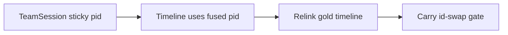

# Fuse player ID stability — eng-loop prompt

**#1 priority:** fuse timeline used `j+1` slot ids → ball-carrier id thrash breaks dribble attribution  
**Entrypoint:** `python3 scripts/eng_loop_fuse_player_id_stable.py` → gates ≥ **9/10**

---

## Problem

Product fuse 15 s stride-4 timeline: **nearest-ball player xy is smooth** (~0.3 m steps) but **ids permute every frame** (7→9→8→6→5…) because `build_check25_event_timeline` assigned `j+1` order ids.

Event dribble cling uses track id for `involved_players`; unstable ids force ball-only window logic.

**Goal:** sticky fuse player ids by pitch xy (≤2.8 m) in live fuse + timeline export; keep event eng-loops green.

---

## Strategy

| Change | Detail |
|--------|--------|
| `team_live.assign_stable_player_ids` | Sticky pitch-xy ids for live fuse |
| `TeamSession.stabilize_fused` | Carry matched pid; new sightings get `next_stable_pid` |
| `build_check25_event_timeline` | Export `[pid, x, y, team]` not `j+1` |
| `timeline_player_ids.relink_timeline_players` | Offline relink for gold scoring |

---

## Gates

| Id | Pass |
|----|------|
| 01 | PROMPT + PROMPT_EVAL |
| 02 | heuristic + dribble_precision + fuse_event_recall + fuse_carry_dribble regression |
| 03 | Carry window **id swaps** (xy jump &lt;2 m) ≤ **1** (baseline ~10) |
| 04 | Carry window **unique** nearest-ball ids ≤ **3** |
| 05 | Dribble TP on **raw** fuse gold still ≥1 (event regression) |
| 06 | `team_stable` eng-loop regression |

Report: `reports/eval_match3/improve_eng_loop/fuse_player_id_stable/scores.json`

---

## Done

Relinked fuse 15 s timeline: stable carrier id through 10.5–11.5 s; dribble `involved_players` consistent; parent loops PASS.
