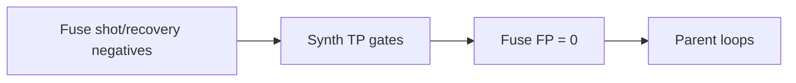

# Fuse shot/recovery gold — eng-loop prompt (#1)

**#1 priority:** shot/recovery only on synth gold — fuse 15 s has no scored TP yet; need FP gates on goal-band passes  
**Entrypoint:** `python3 scripts/eng_loop_fuse_shot_recovery.py` → gates ≥ **9/10**

---

## Problem

Pass/dribble fuse gates are green, but **shot** and **recovery** are untested on product fuse xy. Goal-band fast exits (1.8 s, 5.2 s) must stay **pass**, not shot FP.

**Goal:** Fuse gold negatives + synth TP regression; fuse timeline **0 shot/recovery FP**; parent event loops green.

---

## Strategy

| Piece | Detail |
|-------|--------|
| `build_fuse_shot_recovery_gold.py` | Label pass windows as shot negatives |
| Synth | `synth_shot_goal2` + `synth_recovery` TP |
| Fuse | No shot/recovery emit on `real_fuse_15s` |

---

## Gates

| Id | Pass |
|----|------|
| 01 | PROMPT + PROMPT_EVAL |
| 02 | Synth **shot** TP ≥1 |
| 03 | Synth **recovery** TP ≥1 |
| 04 | Fuse **shot FP** = 0 in neg windows |
| 05 | Fuse **recovery** count = 0 |
| 06 | `fuse_event_recall` + `dribble_precision` regression |

Report: `reports/eval_match3/improve_eng_loop/fuse_shot_recovery/scores.json`

---

## Done

Fuse shot/recovery scored (negatives); synth TP holds; ready for positive fuse windows when coach labels them.
