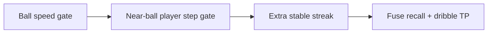

# Fuse teleport / jump masking — eng-loop prompt (#1)

**#1 priority:** fuse stride-4 xy has ball + near-ball **player teleports** — mask before emit so cling/dribble does not run on glitch pairs  
**Entrypoint:** `python3 scripts/eng_loop_fuse_teleport_mask.py` → gates ≥ **9/10**

---

## Problem

Ball-speed gate (`max_ball_speed_m_s=40`) already blocks map jumps (~40 m between stride-4 steps). Fuse gold still has **97** same-id player steps **>6 m** near the ball — dribble proximity cling can latch the wrong pid on the frame *after* a glitch.

**Goal:** Mask unstable frame pairs (ball speed + near-ball player step), keep fuse **pass×2 + dribble×1** on `real_fuse_15s`, zero emits on teleport timestamps.

---

## Strategy

| Piece | Detail |
|-------|--------|
| `EventDetector._near_ball_players_stable` | Skip pair if any player within `movement_proximity` jumps `> max_player_step_m` |
| `audit_fuse_teleports.py` | Report ball + player teleport counts on raw / relinked / linked timelines |
| Gates | Dribble TP 10.5–11.5 s; no emit within 0.15 s of ball teleport `t` |

---

## Gates

| Id | Pass |
|----|------|
| 01 | PROMPT + PROMPT_EVAL |
| 02 | Audit: `ball_teleport_n` ≥ 10 on relinked fuse 15 s |
| 03 | Fuse **dribble TP** ≥ 1 (10.5–11.5 s) |
| 04 | Fuse emits: **2 pass + 1 dribble** (±0) |
| 05 | **0 emits** within 0.15 s after any ball teleport |
| 06 | `fuse_event_recall` + `fuse_carry_dribble` + `fuse_shot_recovery` regression |

Report: `reports/eval_match3/improve_eng_loop/fuse_teleport_mask/scores.json`

---

## Done

Teleport masking on fuse pairs; audit script; fuse dribble + pass recall hold; shot/recovery negatives unchanged.
