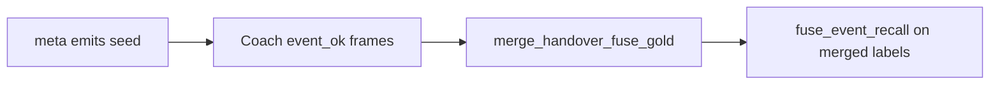

# Handover → fuse gold merge — eng-loop prompt (#1)

**#1 priority:** coach handover labels not wired into fuse event gold  
**Entrypoint:** `python3 scripts/eng_loop_handover_fuse_gold.py` → gates ≥ **9/10**

---

## Problem

`phase1_handover/` collects per-frame QA (`event_ok`, ball/pitch flags) but fuse gold (`real_fuse_15s/labels.json`) was engineer-only. Coach confirmations do not flow into eng-loop scoring.

**Goal:** Seed handover with detector `suggested_events`; merge `event_ok=good` frames into fuse gold; keep fuse recall PASS.

---

## Strategy

| Piece | Detail |
|-------|--------|
| `seed_handover_suggestions` | `suggested_events` from render meta |
| `merge_handover_labels` | `event_ok=good` → gold windows; `bad` → negatives |
| Fixture test | Synthetic coach confirm on 3 emits |

---

## Gates

| Id | Pass |
|----|------|
| 01 | PROMPT + PROMPT_EVAL |
| 02 | Handover has `suggested_events` (3) |
| 03 | Fixture merge adds coach-sourced events |
| 04 | `fuse_event_recall` PASS on merged gold |
| 05 | `fuse_shot_recovery` regression |

Report: `reports/eval_match3/improve_eng_loop/handover_fuse_gold/scores.json`

---

## Done

Coach marks on handover flow into fuse gold; eng-loop scores merged labels.
