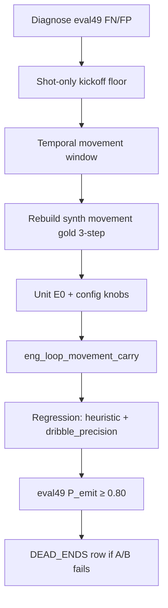

# Movement carry + eval49 holdout — eng-loop prompt

**Mode:** Loop engineering · **Taxonomy fix (not threshold chase)**  
**Entrypoint:** `python3 scripts/eng_loop_movement_carry.py` → all gates ≥ **9/10**  
**Runner:** `python3 scripts/eng_loop_run_movement_carry_prompt.py`

---

## Problem

Primary fuse gates pass (`real_fuse_15s` **P_emit 1.0**) but **holdout eval49** fails taxonomy:

| Clip | P_emit | Issue |
|------|--------|-------|
| `real_fuse_eval_49s` | **0.50** | FN movement @1.8 s (kickoff blocks t&lt;3); FP movement @6.8 s (single-step jitter) |
| `synth_movement_midfield` | FN | 2-frame gold at t=0–1 blocked by movement kickoff |

Batch single-cam says **pass**; fuse says **movement + dribble** — product truth is fuse. Do not retune batch.

---

## Dependency graph

---

## Strategy (locked)

| Do | Don't |
|----|-------|
| Kickoff block **shot only** (map settle FPs) | Lower `EMIT_CONF` |
| Movement **2-step window** + `movement_min_carry_m` ≥ 0.35 | Tune on batch P10 to match fuse volume |
| Keep pass &gt; dribble &gt; movement priority | Retune ball map / hull |
| Report-only: check25 stride-15 | ML event classifier |

### Detector knobs

| Parameter | Value | Role |
|-----------|-------|------|
| `KICKOFF_FLOOR_S` | 3.0 | **Shot** suppress only |
| `movement_window_frames` | 2 | Need 2 co-move steps |
| `movement_min_carry_m` | 0.35 | Reject single-step jitter (eval49 @6.8) |

---

## Gates (`eng_loop_movement_carry.py`)

| Id | Pass (≥9/10) |
|----|----------------|
| 01 | PROMPT exists |
| 02 | `test_heuristic_events_e0.py` exit 0 |
| 03 | `eng_loop_heuristic_events.py` exit 0 |
| 04 | `synth_movement_midfield` TP |
| 05 | **eval49 P_emit ≥ 0.80** |
| 06 | eval49 FP=0 outside gold (incl. late movement) |
| 07 | `real_fuse_15s` P_emit ≥ 0.80 (no regression) |
| 08 | holdout pass window P_emit ≥ 0.80 |
| 09 | `eng_loop_dribble_precision.py` exit 0 |
| 10 | `movement_*` in `configs/default.yaml` |

Report: `reports/eval_match3/improve_eng_loop/movement_carry/scores.json`

---

## Done

eval49 **P_emit ≥ 0.80**; synth movement TP; parent eng-loops green; late single-step movement FP gone.
