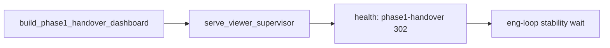

# Phase 1 handover stable launch — eng-loop prompt

**#1 priority:** `serve_viewer` dies when Cursor shells exit → coach gets connection failed  
**Entrypoint:** `python3 scripts/eng_loop_phase1_handover_launch.py` → gates ≥ **9/10**

---

## Problem

Bare `nohup python3 serve_viewer.py` and one-shot `run_viewer_stable.sh` do not keep the handover dashboard alive. Coach needs **supervised** `serve_viewer` with handover-specific health checks.

**Goal:** Supervisor restarts on failure; `start_phase1_handover.sh` builds dashboard + launches; eng-loop proves stable for 15+ s.

---

## Strategy



| Piece | Detail |
|-------|--------|
| `serve_viewer_supervisor.sh` | Restart loop; health = handover redirect + index.html |
| `start_phase1_handover.sh` | `start` / `stop` / `status` / `restart` |
| Eng-loop | Start → immediate health → sleep 15s → health again |

---

## Gates

| Id | Pass |
|----|------|
| 01 | PROMPT + PROMPT_EVAL |
| 02 | Dashboard build writes `index.html` + clip |
| 03 | `start_phase1_handover.sh start-bg` healthy ≤ 20 s |
| 04 | Still healthy after **15 s** wait |
| 05 | Index contains **Events to validate** |
| 06 | `status` subcommand exits 0 |

Report: `reports/eval_match3/improve_eng_loop/phase1_handover_launch/scores.json`

---

## Coach launch

```bash
bash scripts/start_phase1_handover.sh start-bg
# → http://127.0.0.1:8080/phase1-handover
```
